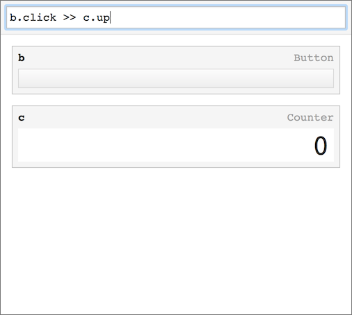

# Order

Reactive environment



## Features

- Connect GUI modules by command-line input
- Data and events of the module flow through the virtual pipeline

## Running locally

- Install [Node](https://nodejs.org/en/download/)
- Install the dependencies

```
npm install
```

Then run:

```
npm start
```

Works on IE10+, Firefox, Safari, Chrome.

## License

&copy; 2016 iOnStage
Licensed under the MIT License.
